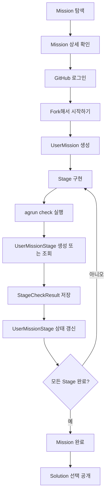

# Agile Runner PRD

상태: Draft v0.4
작성일: 2026-05-28
수정일: 2026-06-29
범위: 제품 방향, MVP 기준, 이후 Spec/Task 작성의 기준 문서

## 요약

Agile Runner는 프레임워크가 대신 처리하던 동작을 직접 만들어보며 배우는 개발 기본기 Code Kata 미션 플랫폼이다.

쉽게 말하면, Spring이 자동으로 해주던 일을 작은 미션으로 쪼개서 직접 만들어보는 서비스다.

- 첫 사용자는 Java/Spring Boot CRUD 경험은 있지만 내부 동작 원리를 설명하기 어려운 취업 준비생 또는 신입/주니어 백엔드 개발자다.
- 첫 Mission은 `HTTP 서버 직접 만들기`다.
- 첫 Stage는 `HTTP 요청 메시지 파서 만들기`다.
- MVP는 Mission 탐색, GitHub fork, `agrun check`, 진행 상태 기록, 선택 공개까지 이어지는 최소 흐름을 만든다.
- AI Agent 사용은 허용하지만, MVP의 핵심은 AI 기능이 아니라 Mission 구조와 CLI 검사 흐름이다.

## 제품 가설

AI 시대의 학습 제품은 AI를 못 쓰게 막는 서비스가 아니라, AI를 쓰더라도 직접 구현하고 비교하며 배울 수 있게 만드는 서비스여야 한다.

Agile Runner는 Mission, Stage, CLI 검사, 완료 기록, 선택 공개를 하나의 흐름으로 묶는다. 이 흐름이 단순 코드 리뷰 봇이나 미션 모음 저장소보다 더 명확한 학습 가치를 만든다고 본다.

## 대상 사용자

| 구분 | 사용자 | 문제 |
| --- | --- | --- |
| Primary | Java/Spring Boot CRUD 경험이 있는 취업 준비생, 신입, 주니어 백엔드 개발자 | 프레임워크 내부 동작을 직접 설명하거나 재현하기 어렵다. |
| Secondary | 기본기 스터디 운영자 | 미션, 검사 기준, 결과물 공유 구조를 직접 만들기 어렵다. |

## 사용 흐름

## MVP 범위

### P0

- GitHub SSO 로그인
- Mission 목록과 상세
- Mission repository fork
- `UserMission` 생성과 진행 상태 표시
- Stage 목록과 Stage별 진행 상태 표시
- `.agile/stage.yml` 기반 CLI 검사
- `.agile/check-result.json` 생성
- `agrun check` 결과 서버 반영
- `StageCheckResult` 저장
- 모든 Stage 완료 시 Mission 완료 자동 기록
- 완료한 Mission의 풀이 선택 공개

### MVP 이후

- 공개 풀이 목록과 상세
- 같은 Mission의 다른 풀이 탐색
- 실패했던 통과 조건과 commit 흐름 연결
- 사용자별 학습 로그
- 사용자 제작 Mission 또는 Stage 제안
- 운영자 검수 화면
- 스터디 모집, 신청, 운영, 아카이브
- AI Agent 프롬프트 흐름 기록
- 면접 질문 기반 복습
- 성장 시스템

## 핵심 개념

| 개념 | 쉬운 설명 | 정확한 의미 |
| --- | --- | --- |
| Mission | 큰 문제집 | 사용자가 fork해서 진행하는 repository 단위 |
| Stage | 문제집 안의 한 문제 | Mission 안에서 CLI 검사와 진행 상태가 기록되는 최소 단위 |
| Stage Manifest | 문제 채점 규칙 | 각 Stage directory의 `.agile/stage.yml` |
| agrun check | 검사 실행 | Stage 통과 조건을 확인하는 CLI 명령 |
| UserMission | 문제집 시작 기록 | 사용자가 Mission을 fork해서 수행하는 기록 |
| UserMissionStage | 문제 진행 기록 | 특정 UserMission 안에서 특정 Stage의 현재 상태 |
| StageCheckResult | 검사 결과 1장 | `agrun check`가 제출한 검사 결과 이력 |
| Solution | 공개 풀이 | 완료한 Mission 결과물을 공개하거나 비공개로 보관하는 기록 |

## 설계 원칙

- 웹은 코딩 환경이 아니다. 미션 탐색, 시작, 진행 확인, 공개를 담당한다.
- Mission은 repository 단위다.
- Stage는 CLI 검사 단위다.
- `agrun check`는 로그인과 Mission 연결이 없으면 실행하지 않는다.
- 검사 결과 제출은 별도 `submit` 명령이 아니라 `agrun check` 안에 포함한다.
- 완료는 사용자가 버튼으로 선언하지 않는다. CLI 통과 결과를 바탕으로 자동 기록한다.
- 완료 상태는 되돌리지 않는다. 이후 실패 결과는 이력으로만 남긴다.
- 결과물 공개는 기본 비공개, 선택 공개를 원칙으로 한다.
- 회고와 풀이 공개는 분리한다.
- MVP는 성장 시스템보다 Mission 진행과 완료 기록을 우선한다.

## 성공 지표

- Mission 상세 조회 후 fork 시작 비율
- fork 후 첫 `agrun check` 실행 비율
- 첫 Stage 완료 비율
- Mission 완료 비율
- Mission 완료 후 선택 공개 비율
- 공개 풀이 조회 비율
- 같은 Stage에서 반복되는 실패 조건 감소율

## 비범위

- 범용 AI 코드 리뷰 SaaS
- 모든 언어와 모든 프레임워크 지원
- 웹 또는 브라우저 기반 코드 실행 환경
- 실시간 채팅형 튜터
- 자체 실시간 채팅 또는 음성 커뮤니티
- hidden test 기반 자동 채점
- 사용자 풀이의 정답 보장
- MVP 성장 시스템

## Open Questions

- DB 제품을 PostgreSQL로 할지 MySQL로 할지 결정한다.
- `StageCheckResult.rawJson`을 DB JSON 타입으로 저장할지 text로 저장할지 결정한다.
- CLI 인증 토큰 저장 방식을 결정한다.
- 사용자 제작 Mission 또는 Stage 제안을 어떤 검수 절차로 받을지 결정한다.
- `docs/specs/platform/mission-manifest.md` 파일명을 `stage-manifest.md`로 변경할지 결정한다.
