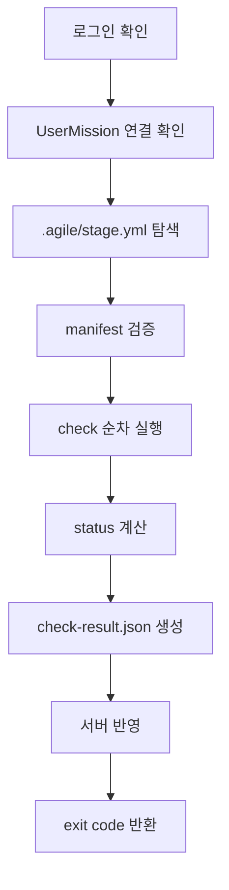
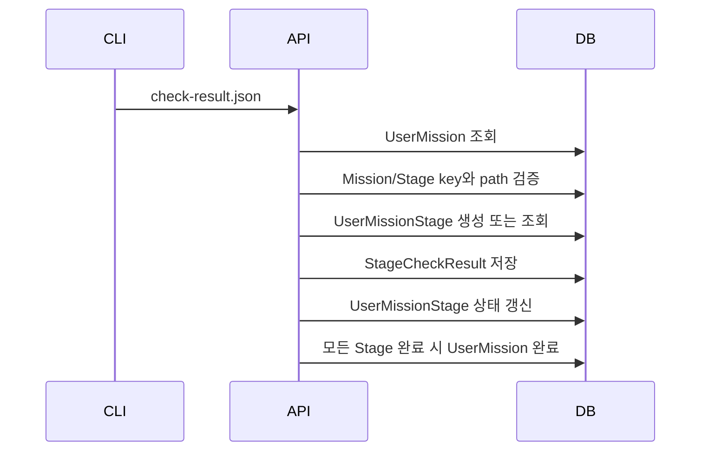

# CLI Check Flow Spec

상태: Draft v0.3
작성일: 2026-06-13
수정일: 2026-06-29
범위: `agrun check` MVP 동작 흐름

## 결론

`agrun check`는 Stage를 검사하고 결과를 서버에 반영하는 MVP 핵심 명령이다.

- 로그인과 Mission 연결이 없으면 검사 실행 전 중단한다.
- 현재 디렉터리에서 가장 가까운 `.agile/stage.yml`을 찾는다.
- Stage root에서 check를 순서대로 실행한다.
- `.agile/check-result.json`을 쓴다.
- 서버에 결과를 보내 `UserMissionStage`와 `UserMission` 상태를 갱신한다.

쉽게 말하면, `agrun check`는 "내가 푼 Stage가 통과했는지 확인하고 웹 진행도에 반영하는 명령"이다.

## 지원 명령

MVP에서 지원하는 명령:

```bash
agrun check
agrun check --json
```

MVP에서 제외:

- `agrun submit`
- `agrun check --upload`
- `agrun check --stage`
- `agrun check --no-write`

검사 결과 업로드는 별도 명령이 아니라 `agrun check` 안에 포함한다.

## 실행 전제

`agrun check`는 다음 전제가 모두 충족되어야 실행된다.

1. CLI가 설치되어 있다.
2. 사용자가 `agrun login`으로 로그인되어 있다.
3. 현재 디렉터리 또는 상위 디렉터리에 `.agile/stage.yml`이 있다.
4. 해당 Stage가 서버의 `UserMission`과 매칭된다.

로그인되지 않은 경우:

```text
Agile Runner에 로그인되어 있지 않습니다.
먼저 `agrun login`을 실행한 뒤 다시 시도하세요.
```

Mission 연결이 없는 경우:

```text
현재 Stage가 Agile Runner Mission과 연결되어 있지 않습니다.
웹에서 Mission을 fork한 뒤 다시 시도하세요.
```

## 기본 흐름



## Stage manifest 탐색

CLI는 현재 작업 디렉터리에서 시작해 상위 디렉터리로 올라가며 가장 가까운 `.agile/stage.yml`을 찾는다.

예:

```text
/workspace/http-server-mission/stages/01-request-message-parser/src/main/java
/workspace/http-server-mission/stages/01-request-message-parser/src/main
/workspace/http-server-mission/stages/01-request-message-parser/src
/workspace/http-server-mission/stages/01-request-message-parser
```

manifest를 찾은 뒤에는 해당 `.agile` 디렉터리의 부모 디렉터리를 Stage root로 본다. 상대 경로는 모두 Stage root 기준으로 해석한다.

manifest를 찾지 못하면 check를 실행하지 않고 exit code `2`를 반환한다.

## Manifest 검증

필수 필드:

- `manifestVersion`
- `mission.id`
- `stage.id`
- `stage.title`
- `checks`

검증 규칙:

- `manifestVersion`은 `1`이어야 한다.
- `checks`는 비어 있지 않아야 한다.
- check `id`는 한 Stage 안에서 중복되면 안 된다.
- check `type`은 지원하는 type이어야 한다.
- check `severity`는 `error`, `warning`, `info` 중 하나여야 한다.

schema validation에 실패하면 전체 status는 `blocked`, exit code는 `2`다.

## Check 실행

| type | 통과 조건 | 실패 조건 |
| --- | --- | --- |
| `command` | 명령 exit code가 0이다. | exit code가 0이 아니다. |
| `forbidden-dependency` | 금지 dependency pattern이 없다. | 금지 pattern이 발견된다. |
| `forbidden-import` | 금지 import pattern이 없다. | 금지 import pattern이 발견된다. |
| `required-file` | 파일이 존재한다. | 파일이 없다. |
| `test-name-pattern` | 조건을 만족하는 테스트 이름이 있다. | 조건을 만족하는 테스트 이름이 없다. |

`command`는 Stage root에서 실행한다. stdout/stderr는 전체를 저장하지 않고 tail만 저장한다.

## Status와 Exit Code

status는 검사 결과이고, exit code는 터미널과 CI가 읽는 숫자다.

| JSON status | 조건 | StageCheckResult | UserMissionStage | exit code |
| --- | --- | --- | --- | --- |
| `passed` | 모든 완료 조건이 통과했다. | `PASSED` | `COMPLETED` | `0` |
| `passed_with_warnings` | 완료 조건은 통과했지만 warning이 있다. | `PASSED_WITH_WARNINGS` | `COMPLETED` | `0` |
| `needs_changes` | `severity = error` check가 실패했다. | `NEEDS_CHANGES` | `NEEDS_CHANGES` | `1` |
| `blocked` | 로그인, 연결, manifest 같은 전제 조건이 부족하다. | `BLOCKED` | `BLOCKED` | `2` |
| `error` | CLI 내부 오류 또는 서버 반영 실패다. | `ERROR` | `ERROR` | `3` |

## 서버 반영

서버 반영 순서:



매칭 규칙:

- `mission.id`는 `missions.mission_key`와 매칭한다.
- `stage.id`는 `stages.stage_key`와 매칭한다.
- 현재 Stage 경로는 `stages.path_in_repository`와 매칭한다.
- `StageCheckResult`는 `UserMissionStage`를 생성하거나 찾은 뒤 저장한다.

서버 반영에 실패하면 로컬 `.agile/check-result.json`은 유지하고 exit code `3`을 반환한다.

## 보류 사항

- CLI 인증 토큰 저장 위치
- 서버 반영 API endpoint
- Windows shell command 실행 규칙
- check result 재전송 정책
- root에서 특정 Stage를 지정해 실행하는 옵션
