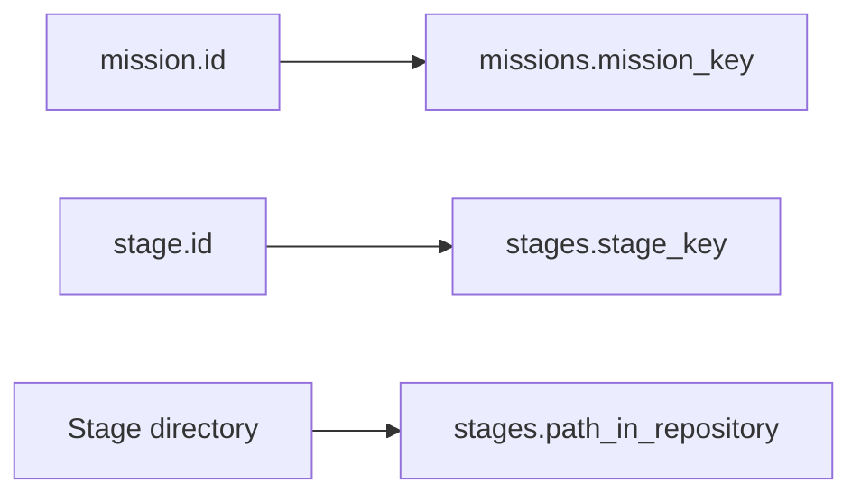

# Stage Manifest Spec

상태: Draft v0.3
작성일: 2026-06-13
수정일: 2026-06-29
범위: `.agile/stage.yml` 구조 정의

> 파일명은 기존 문서 링크를 유지하기 위해 `mission-manifest.md`로 둔다. 문서 파일명 변경은 별도 결정으로 다룬다.

## 결론

Stage manifest는 각 Stage의 채점표다. `agrun check`가 어떤 Stage를 검사하는지, 어떤 명령과 규칙을 실행할지만 담는다.

MVP manifest에는 다음만 둔다.

- `manifestVersion`
- `mission`
- `stage`
- `spec`
- `checks`
- `reflection`

학습 목표, 요구사항, 금지 이유, 제출 안내는 `README.md`나 별도 Stage spec 문서에 둔다.

## 위치

```text
stages/01-request-message-parser/.agile/stage.yml
```

`agrun check`는 현재 디렉터리에서 위로 올라가며 가장 가까운 `.agile/stage.yml`을 찾는다. manifest를 찾으면 `.agile`의 부모 디렉터리를 Stage root로 본다.

## Manifest와 DB 매핑



## Top-level 구조

```yaml
manifestVersion: 1
mission:
  id: http-server
  title: HTTP 서버 직접 만들기
stage:
  id: request-message-parser
  sequence: 1
  title: HTTP 요청 메시지 파서 만들기
spec: README.md
checks:
  - id: test-command
    type: command
    name: 테스트 실행
    severity: error
    params:
      command: ./gradlew test
      timeoutSeconds: 120
reflection:
  path: .agile/reflection.md
```

## 필드 정의

| 필드 | 필수 | 설명 |
| --- | --- | --- |
| `manifestVersion` | 예 | manifest schema version. MVP에서는 `1`만 지원한다. |
| `mission.id` | 예 | `missions.mission_key`와 매칭되는 안정적인 key |
| `mission.title` | 예 | 사용자에게 보이는 Mission 제목 |
| `stage.id` | 예 | `stages.stage_key`와 매칭되는 안정적인 key |
| `stage.sequence` | 예 | Mission 안에서의 진행 순서 |
| `stage.title` | 예 | 사용자에게 보이는 Stage 제목 |
| `spec` | 예 | Stage 상세 문서 경로. MVP 기본값은 `README.md`다. |
| `checks` | 예 | `agrun check`가 실행할 검사 목록 |
| `reflection.path` | 아니오 | 회고 파일 경로. 자동 채점 대상은 아니다. |

## Check 공통 필드

| 필드 | 설명 |
| --- | --- |
| `id` | Stage 안에서 유일한 check id |
| `type` | check type |
| `name` | 사용자에게 보여줄 이름 |
| `severity` | `error`, `warning`, `info` |
| `params` | check type별 설정 |

`severity` 의미:

- `error`: 실패하면 Stage 완료를 막는다.
- `warning`: 실패해도 Stage 완료는 가능하지만 보완을 권장한다.
- `info`: 안내용이다.

## Check Type

| type | params | 동작 |
| --- | --- | --- |
| `command` | `command`, `timeoutSeconds` | 명령을 실행하고 exit code를 확인한다. |
| `forbidden-dependency` | `files`, `patterns` | 빌드 파일에서 금지 dependency를 찾는다. |
| `forbidden-import` | `include`, `patterns` | 소스 파일에서 금지 import를 찾는다. |
| `required-file` | `path` | 필수 파일 존재 여부를 확인한다. |
| `test-name-pattern` | `include`, `minCount`, `patterns` | 테스트 파일 또는 테스트 이름이 특정 pattern을 포함하는지 확인한다. |

## 보류 사항

- 사용자 제작 Stage manifest 검수 절차
- 이 문서 파일명을 `stage-manifest.md`로 변경할지 여부
