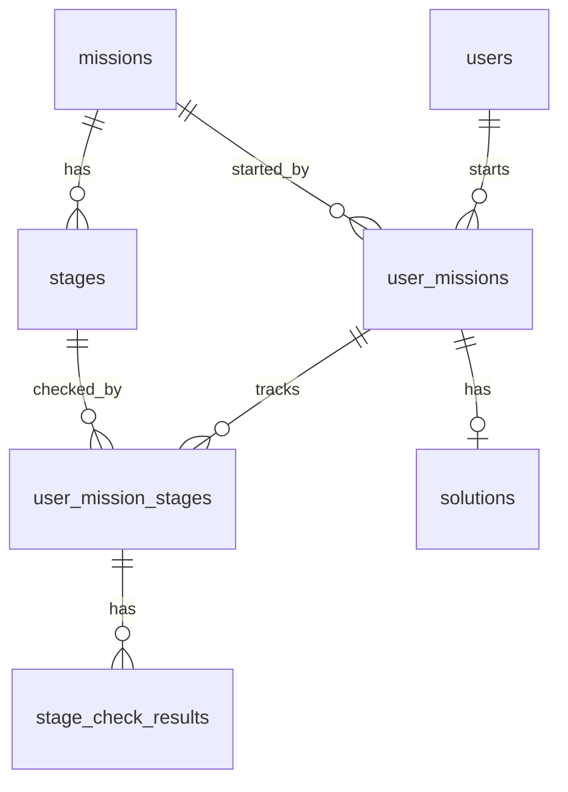

# Database Design Spec

상태: Draft
작성일: 2026-06-24
수정일: 2026-06-29
범위: 웹 MVP 서버 DB 설계 초안

## 결론

MVP DB는 다음 흐름만 저장한다.

```text
GitHub 로그인
-> Mission fork
-> UserMission 생성
-> Stage별 agrun check 실행
-> UserMissionStage 생성 또는 조회
-> StageCheckResult 저장
-> UserMissionStage 상태 갱신
-> 모든 Stage 완료 시 UserMission 완료
-> Solution 선택 공개
```

12세 어린이도 이해할 수 있게 말하면, DB는 "누가 어떤 문제집을 GitHub에서 내 계정으로 복사했고, 어떤 문제를 통과했는지"를 적어두는 장부다.

## ER Graph



## 설계 결정

- `Track`은 두지 않는다. Mission이 fork repository 단위다.
- `GitHubAccount`는 두지 않는다. GitHub 계정 정보는 `users`에 포함한다.
- `RepositoryLink`는 두지 않는다. 공식 repository는 `missions.repository_url`, fork repository는 `user_missions.forked_repository_url`에 둔다.
- `UserGrowth`는 두지 않는다. 성장/통계는 MVP 이후 read model로 추가한다.
- `StageCheckResult`는 count 컬럼을 두지 않는다. 상세 값은 `raw_json`에 둔다.
- 완료 상태는 되돌리지 않는다. 완료 후 실패 결과가 들어와도 이력으로만 남긴다.
- manifest의 `mission.id`는 `missions.mission_key`, `stage.id`는 `stages.stage_key`와 매칭한다.

## 테이블 목록

| 테이블 | 역할 |
| --- | --- |
| `users` | 사용자와 GitHub 계정 정보 |
| `missions` | fork 가능한 공식 Mission |
| `stages` | Mission 안의 CLI 검사 단위 |
| `user_missions` | 사용자가 Mission을 시작한 기록 |
| `user_mission_stages` | 사용자의 Stage 현재 상태 |
| `stage_check_results` | CLI 검사 결과 이력 |
| `solutions` | 완료한 Mission 공개 설정 |

## Manifest와 DB 매핑

| manifest | DB 컬럼 | 의미 |
| --- | --- | --- |
| `mission.id` | `missions.mission_key` | 공식 Mission을 찾는 안정적인 key |
| `stage.id` | `stages.stage_key` | Mission 안에서 Stage를 찾는 안정적인 key |
| Stage directory path | `stages.path_in_repository` | repository 안에서 Stage 디렉터리를 찾는 경로 |
| fork repository URL | `user_missions.forked_repository_url` | 사용자의 fork 저장소 |

## users

| 컬럼 | 타입 | 제약 | 설명 |
| --- | --- | --- | --- |
| `id` | bigint | PK | 내부 사용자 id |
| `github_id` | bigint | unique, not null | GitHub가 부여한 변경되지 않는 사용자 id |
| `github_username` | varchar(80) | not null | GitHub username |
| `display_name` | varchar(80) | not null | 화면에 보여줄 이름 |
| `profile_image_url` | varchar(500) | nullable | 프로필 이미지 URL |
| `created_at` | datetime | not null | 생성 시각 |
| `updated_at` | datetime | not null | 수정 시각 |

## missions

| 컬럼 | 타입 | 제약 | 설명 |
| --- | --- | --- | --- |
| `id` | bigint | PK | 내부 Mission id |
| `mission_key` | varchar(80) | unique, not null | manifest의 `mission.id` |
| `title` | varchar(160) | not null | Mission 제목 |
| `description` | text | not null | Mission 설명 |
| `repository_url` | varchar(500) | not null | 공식 Mission repository URL |
| `created_at` | datetime | not null | 생성 시각 |
| `updated_at` | datetime | not null | 수정 시각 |

MVP에서는 seed data로 관리한다.

## stages

| 컬럼 | 타입 | 제약 | 설명 |
| --- | --- | --- | --- |
| `id` | bigint | PK | 내부 Stage id |
| `mission_id` | bigint | FK, not null | 소속 Mission |
| `stage_key` | varchar(80) | not null | manifest의 `stage.id` |
| `sequence` | int | not null | Mission 안에서의 진행 순서 |
| `title` | varchar(160) | not null | Stage 제목 |
| `description` | text | not null | Stage 설명 |
| `path_in_repository` | varchar(300) | not null | Mission repository root 기준 Stage 디렉터리 상대 경로 |
| `created_at` | datetime | not null | 생성 시각 |
| `updated_at` | datetime | not null | 수정 시각 |

제약:

- `(mission_id, sequence)`는 unique다.
- `(mission_id, stage_key)`는 unique다.
- `(mission_id, path_in_repository)`는 unique다.

## user_missions

| 컬럼 | 타입 | 제약 | 설명 |
| --- | --- | --- | --- |
| `id` | bigint | PK | 내부 id |
| `user_id` | bigint | FK, not null | 수행 사용자 |
| `mission_id` | bigint | FK, not null | 수행 Mission |
| `status` | varchar(30) | not null | `IN_PROGRESS`, `COMPLETED` |
| `forked_repository_url` | varchar(500) | not null | 사용자가 fork한 repository URL |
| `started_at` | datetime | not null | fork 성공 후 Mission 수행이 시작된 시각 |
| `completed_at` | datetime | nullable | 모든 Stage를 완료한 시각 |
| `created_at` | datetime | not null | 생성 시각 |
| `updated_at` | datetime | not null | 수정 시각 |

제약:

- `(user_id, mission_id)`는 unique다.
- 시작 전에는 row가 없다.
- `completed_at`이 있으면 `status = COMPLETED`다.

## user_mission_stages

| 컬럼 | 타입 | 제약 | 설명 |
| --- | --- | --- | --- |
| `id` | bigint | PK | 내부 id |
| `user_mission_id` | bigint | FK, not null | 사용자의 Mission 수행 기록 |
| `stage_id` | bigint | FK, not null | 수행한 Stage |
| `status` | varchar(30) | not null | `NEEDS_CHANGES`, `BLOCKED`, `COMPLETED`, `ERROR` |
| `completed_at` | datetime | nullable | Stage가 처음 완료된 시각 |
| `created_at` | datetime | not null | 생성 시각 |
| `updated_at` | datetime | not null | 수정 시각 |

제약:

- `(user_mission_id, stage_id)`는 unique다.
- 첫 CLI 검사 결과가 들어오기 전에는 row가 없다.
- `stage_id`는 `user_mission_id`가 가리키는 Mission에 속한 Stage여야 한다.
- `COMPLETED`가 된 뒤에는 실패 결과가 들어와도 status를 되돌리지 않는다.

## stage_check_results

| 컬럼 | 타입 | 제약 | 설명 |
| --- | --- | --- | --- |
| `id` | bigint | PK | 내부 id |
| `user_mission_stage_id` | bigint | FK, not null | 연결된 UserMissionStage |
| `status` | varchar(40) | not null | CLI check-result의 전체 status |
| `raw_json` | json/text | not null | CLI가 제출한 `check-result.json` 원본 |
| `created_at` | datetime | not null | 서버가 결과를 받은 시각 |

제약:

- `status` 값은 `PASSED`, `PASSED_WITH_WARNINGS`, `NEEDS_CHANGES`, `BLOCKED`, `ERROR` 중 하나다.
- `raw_json`은 신뢰하지 않는 입력이다.
- `raw_json`은 최대 크기를 제한한다.
- 화면에는 raw JSON을 그대로 출력하지 않는다.

## solutions

| 컬럼 | 타입 | 제약 | 설명 |
| --- | --- | --- | --- |
| `id` | bigint | PK | 내부 id |
| `user_mission_id` | bigint | FK, unique, not null | 완료한 Mission 수행 기록 |
| `memo` | text | nullable | 사용자가 남기는 짧은 메모 |
| `visibility` | varchar(30) | not null | `PRIVATE`, `PUBLIC` |
| `published_at` | datetime | nullable | 공개 시각 |
| `created_at` | datetime | not null | 생성 시각 |
| `updated_at` | datetime | not null | 수정 시각 |

제약:

- `user_mission.status = COMPLETED`인 경우에만 공개할 수 있다.
- 기본값은 `PRIVATE`다.
- `visibility = PUBLIC`이면 `published_at`이 있어야 한다.
- `visibility = PRIVATE`이면 `published_at`은 비운다.
- 공개 링크는 `user_missions.forked_repository_url`을 사용한다.

## 상태 갱신

### Stage 결과 반영

| CLI 결과 | UserMissionStage 상태 |
| --- | --- |
| `PASSED` | `COMPLETED` |
| `PASSED_WITH_WARNINGS` | `COMPLETED` |
| `NEEDS_CHANGES` | `NEEDS_CHANGES` |
| `BLOCKED` | `BLOCKED` |
| `ERROR` | `ERROR` |

### Mission 완료

1. Mission의 모든 Stage에 대응하는 `user_mission_stages` row가 있는지 확인한다.
2. 모든 row의 status가 `COMPLETED`이면 `user_missions.status = COMPLETED`로 바꾼다.
3. `completed_at`을 기록한다.
4. 완료 후에는 실패 결과가 들어와도 완료 상태를 되돌리지 않는다.

## 화면별 조회 기준

| 화면 | 조회 기준 |
| --- | --- |
| Mission 목록 | `missions` |
| Mission 상세 | `missions`, `stages`, 현재 사용자의 `user_missions` |
| 진행 중인 Mission | `user_missions.status = IN_PROGRESS` |
| 완료한 Mission | `user_missions.status = COMPLETED` |
| Stage 진행 상태 | `stages`와 `user_mission_stages` |
| 검사 이력 | `stage_check_results` |
| 풀이 목록 | `solutions.visibility = PUBLIC` |

## 다음 결정

- DB 제품을 PostgreSQL로 할지 MySQL로 할지 결정한다.
- `raw_json`을 DB JSON 타입으로 저장할지 text로 저장할지 결정한다.
- `agrun check`가 사용할 CLI 인증 토큰 저장 방식을 결정한다.
