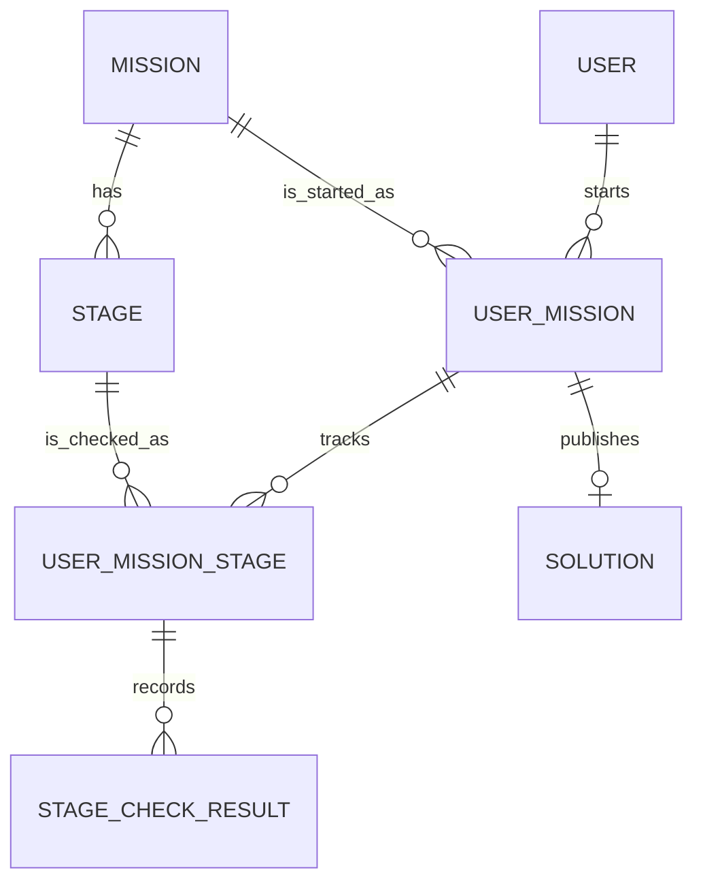

# Server Domain Model Spec

상태: Draft
작성일: 2026-06-24
수정일: 2026-06-29
범위: 웹 MVP를 위한 서버 도메인 모델

## 결론

MVP 서버는 사용자가 Mission을 fork해서 시작하고, Mission 안의 Stage를 `agrun check`로 통과한 기록을 저장한다.

12세 어린이도 이해할 수 있게 말하면 다음과 같다.

- `Mission`은 사용자가 fork하는 큰 문제집이다.
- `Stage`는 문제집 안에 있는 한 문제다.
- `UserMission`은 어떤 사용자가 어떤 문제집을 풀기 시작했다는 기록이다.
- `UserMissionStage`는 그 사용자가 특정 문제를 어디까지 풀었는지 보여주는 기록이다.
- `StageCheckResult`는 `agrun check`를 한 번 실행한 결과다.
- `Solution`은 완료한 문제집을 공개할지 말지 정하는 기록이다.

## 관계 Graph



## MVP 모델

| 모델 | 뜻 | 생성 시점 |
| --- | --- | --- |
| `User` | 서비스 사용자 | GitHub 로그인 성공 |
| `Mission` | fork하는 repository 단위 | 운영자가 미리 등록 |
| `Stage` | CLI 검사 단위 | 운영자가 미리 등록 |
| `UserMission` | 사용자가 Mission을 시작한 기록 | fork 성공 |
| `UserMissionStage` | 사용자의 Stage 현재 상태 | 첫 CLI 검사 결과 도착 |
| `StageCheckResult` | CLI 검사 결과 1건 | `agrun check` 결과 업로드 |
| `Solution` | 완료한 Mission의 공개 설정 | 완료 후 사용자가 공개 또는 저장 |

## Manifest와 모델 매핑

| manifest | 모델 필드 | 설명 |
| --- | --- | --- |
| `mission.id` | `Mission.key` | 공식 Mission을 찾는 안정적인 key |
| `stage.id` | `Stage.key` | Mission 안에서 Stage를 찾는 안정적인 key |
| Stage directory path | `Stage.pathInRepository` | repository 안에서 Stage 디렉터리를 찾는 경로 |

MVP에서 제외한다.

- `Track`
- `GitHubAccount`
- `MissionProgress`
- `StageProgress`
- `RepositoryLink`
- `CheckResultSubmission`
- `UserGrowth`

## 모델 정의

### User

서비스 사용자다. GitHub 계정 정보는 별도 객체로 나누지 않고 `User`에 둔다.

필드:

- `id`
- `githubId`
- `githubUsername`
- `displayName`
- `profileImageUrl`
- `createdAt`
- `updatedAt`

### Mission

사용자가 fork해서 진행하는 큰 구현 목표이자 repository 단위다.

필드:

- `id`
- `key`
- `title`
- `description`
- `repositoryUrl`
- `createdAt`
- `updatedAt`

### Stage

Mission 안에서 CLI 검사와 진행 상태가 기록되는 최소 단위다.

`Stage`를 별도 모델로 두는 이유는 분류가 아니라 검사 단위를 표현하기 위해서다. `agrun check`는 Mission 전체가 아니라 특정 Stage의 `.agile/stage.yml`을 기준으로 실행된다.

필드:

- `id`
- `missionId`
- `key`
- `sequence`
- `title`
- `description`
- `pathInRepository`
- `createdAt`
- `updatedAt`

`pathInRepository`는 Mission repository root 기준 Stage 디렉터리 경로다.

예:

```text
stages/01-request-message-parser
```

### UserMission

User와 Mission의 N:N 관계를 푸는 중간 객체다. 사용자가 특정 Mission을 수행 중이라는 뜻도 가진다.

`UserMission`은 fork 성공 후 생성한다. 시작 전에는 row가 없다.

필드:

- `id`
- `userId`
- `missionId`
- `status`
- `forkedRepositoryUrl`
- `startedAt`
- `completedAt`
- `createdAt`
- `updatedAt`

상태:

```text
IN_PROGRESS
COMPLETED
```

### UserMissionStage

UserMission과 Stage의 관계를 푸는 중간 객체다. 특정 사용자가 특정 Mission 안의 Stage를 어디까지 진행했는지 보여준다.

첫 CLI 검사 결과가 들어올 때 생성한다. CLI 결과가 없으면 row가 없다.

필드:

- `id`
- `userMissionId`
- `stageId`
- `status`
- `completedAt`
- `createdAt`
- `updatedAt`

상태:

```text
NEEDS_CHANGES
BLOCKED
COMPLETED
ERROR
```

### StageCheckResult

`agrun check`가 만든 검사 결과 1건이다. 현재 상태가 아니라 이력이다.

필드:

- `id`
- `userMissionStageId`
- `status`
- `rawJson`
- `createdAt`

`rawJson`은 CLI가 제출한 `check-result.json` 원본이다. 신뢰하지 않는 입력으로 다룬다.

규칙:

- raw JSON은 저장한다.
- raw JSON을 그대로 화면에 출력하지 않는다.
- raw JSON 전체를 로그에 남기지 않는다.
- 화면에는 서버가 검증한 값만 사용한다.
- 최대 크기를 제한한다.
- schema version과 소유권을 검증한다.

상태:

```text
PASSED
PASSED_WITH_WARNINGS
NEEDS_CHANGES
BLOCKED
ERROR
```

### Solution

완료한 Mission 결과물을 공개하거나 비공개로 보관하는 객체다.

필드:

- `id`
- `userMissionId`
- `memo`
- `visibility`
- `publishedAt`
- `createdAt`
- `updatedAt`

`Solution`은 repository URL을 직접 가지지 않는다. 공개 링크는 `UserMission.forkedRepositoryUrl`을 사용한다.

상태:

```text
PRIVATE
PUBLIC
```

규칙:

- 기본 상태는 `PRIVATE`다.
- `PUBLIC`으로 바꿀 때 `publishedAt`을 기록한다.
- 다시 `PRIVATE`로 바꾸면 `publishedAt`을 비운다.
- 공개와 비공개 전환은 허용한다.

## 상태 갱신 규칙

### Mission 시작

1. 사용자가 웹에서 `Fork해서 시작하기`를 누른다.
2. GitHub fork가 성공한다.
3. `UserMission`을 생성한다.
4. `UserMission.status = IN_PROGRESS`로 둔다.
5. `UserMission.forkedRepositoryUrl`을 저장한다.

시작 전에는 `UserMission` row가 없다.

### Stage 검사 결과 반영

1. 사용자가 fork한 repository의 Stage directory에서 `agrun check`를 실행한다.
2. CLI는 로그인과 UserMission 연결을 먼저 확인한다.
3. 로그인 또는 연결이 없으면 검사 실행 전 중단한다.
4. 로컬 검사를 실행하고 `check-result.json`을 만든다.
5. 서버에 검사 결과를 보낸다.
6. 서버는 해당 `UserMissionStage`를 찾는다.
7. 해당 `UserMissionStage`가 없으면 생성한다.
8. `StageCheckResult`를 저장한다.
9. `StageCheckResult.status`를 `UserMissionStage.status`로 매핑한다.

상태 매핑:

| StageCheckResult | UserMissionStage |
| --- | --- |
| `PASSED` | `COMPLETED` |
| `PASSED_WITH_WARNINGS` | `COMPLETED` |
| `NEEDS_CHANGES` | `NEEDS_CHANGES` |
| `BLOCKED` | `BLOCKED` |
| `ERROR` | `ERROR` |

`PASSED_WITH_WARNINGS`는 완료를 막지 않는다. 경고 내용은 `StageCheckResult.rawJson`에 남긴다.

### Mission 완료

Mission의 모든 Stage에 대응하는 `UserMissionStage`가 있고, 모든 상태가 `COMPLETED`이면 `UserMission.status = COMPLETED`로 바꾼다.

완료 후 상태는 되돌리지 않는다.

- `UserMissionStage`가 `COMPLETED`가 된 뒤 실패 결과가 들어와도 status를 되돌리지 않는다.
- `UserMission`이 `COMPLETED`가 된 뒤 다시 `IN_PROGRESS`로 되돌리지 않는다.
- 이후 실패 결과는 `StageCheckResult` 이력으로만 남긴다.

## MVP 이후

- 성장 시스템과 `UserLearningStats`
- Stage별 풀이 공개
- GitHub Actions 기반 검사 결과 업로드
- 개인 저장소 연결
- 사용자 제작 Mission 또는 Stage 제안
- GitHub Checks 연동
- AI 요약과 코칭
