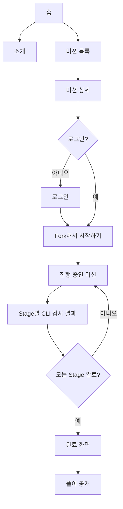

# Web MVP Screen Flow

상태: Draft
작성일: 2026-06-21
수정일: 2026-06-29
범위: MVP 웹 화면 흐름, 확장 예정 영역, 화면별 최소 데이터

## 결론

Agile Runner 웹은 코딩하는 곳이 아니다. 사용자가 Mission을 고르고, GitHub 저장소를 fork해서 시작하고, `agrun check` 결과를 확인하는 곳이다.

쉽게 말하면, 웹은 "문제 고르기, 시작하기, 진행 보기, 완료 후 공개하기"를 맡는다.

## 전체 화면 흐름



## 용어 원칙

사용자 화면에서는 내부 용어를 그대로 노출하지 않는다.

사용자에게 보이는 표현:

- CLI로 미션 통과 조건 검사
- CLI 검사 결과
- 통과 조건

구현 이름은 `agrun check`, `StageCheckResult`를 우선한다. 별도의 검사 도메인 모델은 만들지 않는다.

## 내비게이션

로그인 전:

```text
Agile Runner | 소개 | 미션 | 로그인
```

로그인 후:

```text
Agile Runner | 소개 | 미션 | seaung13 [아바타]
```

상단에는 `GitHub 로그인`처럼 provider 이름을 직접 쓰지 않는다. `로그인`을 누른 뒤 인증 화면에서 `GitHub로 계속하기`를 보여준다.

프로필 메뉴:

```text
[아바타] seaung13 >
[Clock] 진행 중인 미션
[CheckCircle] 완료한 미션
[Share2] 공개한 풀이
[Settings] 계정 설정
[LogOut] 로그아웃
```

`마이페이지`는 상단 메뉴로 두지 않는다.

## 검색

검색창은 내비게이션 바 안에 넣지 않고, 홈이나 목록 화면의 상단 검색 영역으로 둔다.

```text
미션을 검색해보세요
```

MVP에서는 Mission 검색만 다룬다.

## 화면별 역할

| 화면 | 역할 | MVP에서 필요한 것 |
| --- | --- | --- |
| 홈 | 서비스가 무엇인지 알려주고 미션 탐색으로 보낸다. | 핵심 문장, 검색, 대표 Mission 카드 |
| 소개 | 왜 직접 구현해보는지 설명한다. | 학습 철학, AI Agent 사용 원칙 |
| 미션 목록 | 시작할 Mission을 고른다. | Mission 카드, Stage 수, 도전자 수, 완료자 수 |
| 미션 상세 | Mission을 시작할지 판단한다. | 개요, Stage 목록, 통과 조건, 시작 버튼 |
| Stage 상세 | Stage에서 구현할 내용을 확인한다. | 요구사항, 금지 조건, CLI 통과 조건 |
| 진행 중인 미션 | 현재 진행 상태를 본다. | Stage별 상태, 최신 CLI 결과, 검사 이력 |
| 완료 화면 | 완료 결과를 확인한다. | 완료한 Stage 목록, 풀이 공개 버튼 |
| 풀이 공개 | 완료한 결과물을 공개한다. | fork repository 링크, memo, 공개 여부 |

## 홈

핵심 문장:

```text
프레임워크가 대신 처리하던 구현을 직접 만들어보는 미션 플랫폼
```

보조 문장:

```text
HTTP, DI, 트랜잭션 같은 백엔드 동작 원리를 작은 Stage로 나누어 직접 구현합니다.
```

홈에 최근 공개된 풀이 피드를 전면 배치하지 않는다. 첫 인상은 커뮤니티 피드가 아니라 미션 기반 학습 플랫폼이어야 한다.

## 미션 목록

Mission은 fork 가능한 repository 단위다.

카드 예시:

```text
HTTP 서버 직접 만들기
- HTTP 요청 메시지 파서 만들기
- URL path 처리하기
- HTTP 응답 메시지 만들기
```

Mission 카드에는 다음을 보여준다.

- Mission 제목
- 설명
- 대표 Stage 목록
- Stage 수
- 도전자 수
- 완료자 수
- 현재 사용자의 진행 여부

MVP에서는 난이도, 예상 시간, XP를 카드 필수 정보로 두지 않는다.

## 미션 상세

상단은 GitHub repository 페이지처럼 핵심 정보와 시작 액션을 둔다.

```text
HTTP 서버 직접 만들기 [Fork해서 시작하기]
도전자 128명 · 완료 34명 · Stage 3개
```

탭:

```text
개요 | Stage | 통과 조건
```

탭 역할:

- 개요: 왜 이 Mission을 하는지 설명한다.
- Stage: Mission 안의 Stage 목록과 각 Stage 설명을 보여준다.
- 통과 조건: CLI가 어떤 방식으로 Stage 통과 조건을 검사하는지 설명한다.

`풀이`, `토론`, `커뮤니티`는 MVP 이후 화면으로 둔다.

## 미션 시작

미션 탐색과 상세 조회는 로그인 없이 가능하다. 다음 행동부터 로그인이 필요하다.

- Fork해서 시작하기
- 진행 상태 저장
- CLI 검사 결과 연동
- Mission 완료 자동 기록
- 완료 후 풀이 공개

흐름:

```text
Fork해서 시작하기
-> 로그인 여부 확인
-> 로그인하지 않았다면 로그인 화면
-> GitHub로 Mission repository fork
-> UserMission 생성
-> forkedRepositoryUrl 저장
-> 진행 중인 미션에 자동 반영
-> 로컬 실행 안내
```

개인 저장소 연결은 MVP에서 제외한다. 시작 흐름은 fork를 기본으로 둔다.

로컬 안내:

```text
1. fork된 저장소를 clone합니다.
2. Stage 디렉터리로 이동합니다.
3. 요구사항에 맞게 구현합니다.
4. agrun check로 CLI 검사를 실행합니다.
```

## 진행 중인 미션

MVP 요소:

- Mission 제목
- 현재 Mission 상태
- fork된 repository URL
- Stage별 상태
- 최신 CLI 검사 결과
- CLI 검사 이력

완료는 사용자가 버튼으로 기록하지 않는다. `agrun check` 통과 결과가 서버에 들어오면 Stage 완료가 자동으로 기록되고, 모든 Stage가 완료되면 Mission 완료가 자동으로 기록된다.

CLI 검사 결과가 아직 없는 Stage는 DB row를 만들지 않는다. 화면에서는 이 상태를 저장하지 않고 `아직 검사 전`으로 표시한다.

## 풀이 공개

공개 대상:

- 완료한 Mission
- fork된 GitHub repository 링크
- 사용자가 작성한 짧은 memo

공개하지 않은 풀이는 기본 비공개다.

회고와 풀이는 분리한다. MVP에서는 풀이 공개에 짧은 memo만 둔다. 회고 질문, 면접 질문, AI 질문 생성은 MVP 이후 기능으로 남긴다.

## 화면별 최소 데이터

| 화면 | 필요한 모델 |
| --- | --- |
| 미션 목록 | `Mission`, `Stage` |
| 미션 상세 | `Mission`, `Stage`, 현재 사용자의 `UserMission`, `UserMissionStage` |
| 진행 중인 미션 | `UserMission`, `Stage`, `UserMissionStage`, 최신 `StageCheckResult` |
| 풀이 공개 | `Solution`, `UserMission`, `Mission`, `User` |

세부 필드는 [Database Design Spec](../server/database-design.md)을 따른다.

## MVP 이후

- 풀이 목록과 풀이 상세
- 커뮤니티 글 작성과 댓글
- 사용자 제작 Mission 또는 Stage 제안
- 운영자 Mission 관리
- 성장 시스템
- AI Agent 프롬프트 흐름 기록
- 면접 질문 기반 복습 기능
